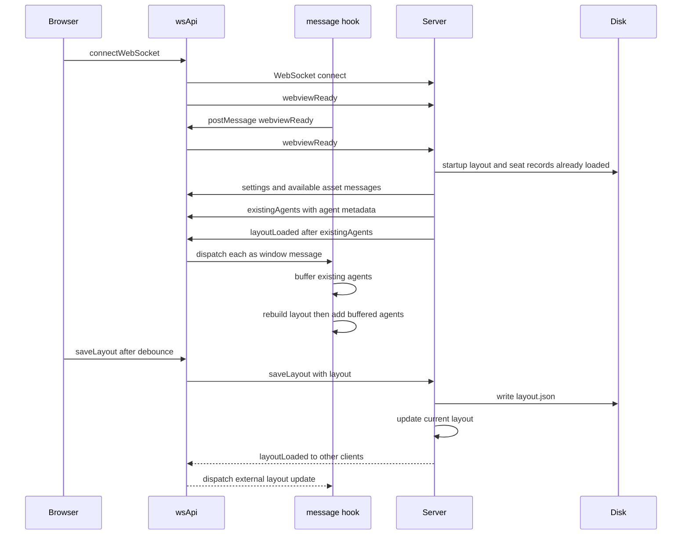

## Overview

Pixel Agents replaces the upstream VS Code extension/webview bridge with a local Node process and a browser application. The Node entrypoint combines three boundaries:

- **Transcript ingestion:** `JsonlWatcher` finds active JSONL sessions under `~/.claude/projects/`, follows them by polling, and emits complete lines. The parser converts those lines into agent and tool lifecycle events.
- **Authoritative shared state and persistence:** `server/index.ts` owns the session-to-agent map, monotonically allocated agent IDs, connected sockets, startup-loaded assets, and the current office layout. It persists the layout and character seat metadata under `~/.pixel-agents/`.
- **Delivery and rendering:** Express serves the built UI and the same HTTP server accepts WebSocket clients. The React client retains the upstream-facing `window` message interface: `wsApi.ts` turns socket input into `MessageEvent`s, while `vscodeApi.ts` redirects `vscode.postMessage` calls to the socket.

This is intentionally a visualization channel, not a remote-control API. Some inherited UI actions such as `focusAgent`, `closeAgent`, and `openClaude` are sent through the stub but have no server-side handler, so they have no effect in standalone mode.

## Processes, entrypoints, and state ownership

`npm run build` bundles `server/index.ts` into `dist/server.js`, builds the Vite UI into `dist/public`, and copies `public/assets` beside it. `npm start` runs that server. In development, `npm run dev` starts `tsx watch server/index.ts` and Vite concurrently; the UI's development socket target remains `ws://localhost:3456`. In a production browser build it instead derives `ws://` plus `window.location.host`.

The server listens on `PORT` or `3456` by default and serves static files from its `public` directory. It chooses its asset root based on execution location: source-tree assets in development, or `dist/public/assets` after the production build. At startup it decodes character, wall, floor, and furniture assets into data sent over the socket rather than having the browser fetch the individual PNGs.

The server's `agents` map is keyed by stable Claude session ID; each `TrackedAgent` carries its display ID, project metadata, transcript read position, active parent and subagent tools, activity flags, and parser timer-related state. It is in-memory only. Restarting the process reconstructs currently active sessions from their transcripts, but display IDs restart at 1 and live activity state is not persisted. The layout and seat records are separate durable UI state.

`JsonlWatcher` does an initial scan and then watches for JSONL files. A file modified within ten minutes is considered active; it is read from offset zero on discovery so a late-starting server catches up, then polled every second for appended complete lines. A missing, unreadable, or stale file produces removal, which removes and broadcasts closure for its corresponding agent. Invalid transcript JSON is ignored by the parser.

## Startup restoration and initial-data ordering

At startup, the server first tries `~/.pixel-agents/layout.json`; malformed or unreadable persisted layout falls back to `default-layout.json` in the assets directory. Seat metadata is similarly read from `~/.pixel-agents/agent-seats.json`, but unreadable seat data is simply absent. Missing optional floors or furniture assets are omitted from the initial stream; unavailable character or wall assets are also not sent.

The browser opens its connection before React mounts. The socket sends `webviewReady` on open, and the message hook sends it again after installing its `window` listener. Either `webviewReady` or `ready` requests a full initial snapshot, so duplicate readiness messages can cause a second initialization stream. The initial stream is deliberately ordered: settings; available sprite/tile/catalog payloads; `existingAgents`; then `layoutLoaded`. The hook buffers the listed existing agents until it has rebuilt the layout and its seats, then adds them with their persisted palette, hue shift, seat ID, and folder name. `layoutReady` gates rendering of the office.

*Connection, ordered bootstrap, and cross-tab layout synchronization; the sender does not receive its own saved layout broadcast.*

## WebSocket contract

Messages are JSON objects discriminated by `type`. `ServerMessage` and `ClientMessage` in `server/types.ts` describe the intended contract, but runtime parsing is not schema validation: the server branches on `msg.type` after `JSON.parse`.

### Client to server

| Message | Payload | Effect |
| --- | --- | --- |
| `webviewReady` or `ready` | none | Sends the complete initial snapshot to that socket. |
| `saveLayout` | `layout` | Writes `~/.pixel-agents/layout.json`, updates the server's current layout, and sends `layoutLoaded` to every *other* open client. |
| `saveAgentSeats` | `seats` keyed by numeric agent ID, with `palette`, `hueShift`, and nullable `seatId` | Writes `~/.pixel-agents/agent-seats.json`; it is later included in `existingAgents`. |

The editor immediately rebuilds its local office for each edit and schedules `saveLayout` using `LAYOUT_SAVE_DEBOUNCE_MS`. The explicit Save button uses the same path. A server save failure is logged only; there is no acknowledgement, retry, version check, or client-visible error. The `version: 1` attached to `layoutLoaded` is a fixed value, not a concurrency revision. Consequently, simultaneous tabs are last-writer-wins on disk, and a receiving editor rejects external layout updates while it is both in edit mode and dirty to avoid overwriting unsaved local work.

### Server to client

| Group | Messages and payload meaning |
| --- | --- |
| Bootstrap | `settingsLoaded` provides `soundEnabled`; sprite/tile messages provide character, wall, optional floor, and optional furniture catalog/sprite data; `existingAgents` supplies IDs, project names, and optional palette/hue/seat metadata; `layoutLoaded` supplies a layout and fixed version. A null layout tells the UI to retain/snapshot its own default office. |
| Agent membership | `agentCreated` supplies ID and folder name; `agentClosed` supplies ID. |
| Parent-agent activity | `agentToolStart`, `agentToolDone`, and `agentToolsClear` maintain tool overlays. `agentStatus` communicates activity or waiting; `agentToolPermission` and `agentToolPermissionClear` control permission indicators. |
| Subagent activity | `subagentToolStart`, `subagentToolDone`, `subagentToolPermission`, and `subagentClear` carry the parent agent ID and parent tool ID so the UI can render and clean up a subordinate character and its tools. |

Agent events are broadcast to all currently open sockets. The transcript parser is the producer of these activity messages: assistant tool use yields starts and active status, tool results yield delayed completion, `turn_duration` clears tools and emits waiting, and nested Task progress becomes the subagent variants. This means a reconnect receives the current agent roster and seats but not a replay of currently active tools or statuses; subsequent transcript events repopulate those transient overlays.

## Connection lifecycle and failure behavior

The browser transport has a small compatibility adapter rather than modifying the existing hook. Every incoming socket frame is parsed and dispatched as a `window` `message`, and outgoing calls through `vscode.postMessage` serialize only when the socket is `OPEN`. A closed socket triggers a new connection attempt after two seconds; `onerror` closes the socket to enter that path. There is no outbound queue, exponential backoff, authentication, or secure `wss://` selection in this adapter, so messages issued while disconnected are dropped and deployments should treat it as a local HTTP/WebSocket service unless transport protection is added.

On the server, each connected socket is inserted into `clients`, removed on `close`, and marked alive on `pong`. A 30-second heartbeat pings every client; a socket that did not answer the preceding interval is removed and terminated. This cleanup matters operationally because the client set is part of the idle-shutdown guard. Client frames that cannot be parsed as JSON are caught and ignored; syntactically valid but unrecognized message types also fall through without action. File-write failures are caught and logged. The browser side does not catch malformed server frames before `JSON.parse`, so server changes must preserve valid JSON.

The server checks every 30 seconds for idleness. If there are no tracked agents, no tracked clients, and no transcript activity for ten minutes, it stops the watcher, closes the HTTP server, and exits. `SIGINT` follows the same watcher-stop and server-close pattern. A launcher hook can health-check the HTTP root and start `node dist/server.js` when needed, but the server itself does not restart after idle exit.

## Safe extension points and checks

When adding a new event, update the discriminated type definitions, the parser or other server producer, and the hook's `window` message handler together. Preserve the bootstrap dependency: any asset needed to interpret a layout must precede `layoutLoaded`, and `existingAgents` must stay before it because the hook buffers those agents specifically for seat reconstruction. If a client-side message needs a response or durable conflict semantics, add an explicit acknowledgement or revision protocol rather than treating the fixed `version` field as one.

The repository does not define project test scripts or source-level tests for this protocol. Focused manual verification should therefore cover: a cold start with and without persisted files; an active transcript discovered before the browser connects; reconnect after a server restart; a heartbeat-cleaned dead tab; cross-tab layout save propagation; and a dirty receiving editor retaining its local edits. Run `npm run build` to validate the coupled production asset layout and server/UI compilation.
