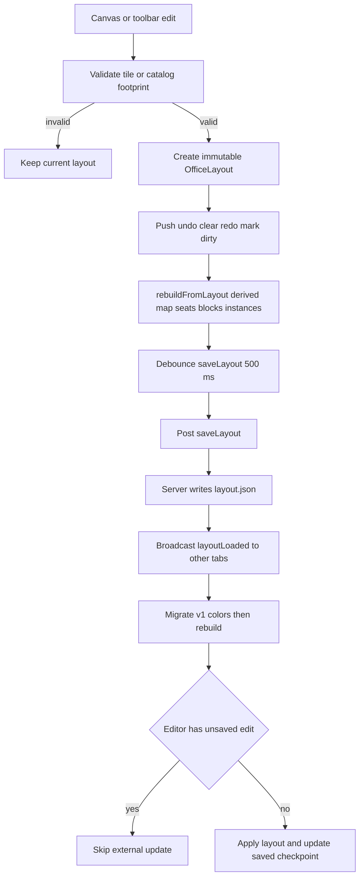

`OfficeLayout` is the durable description of the office; `OfficeState` is its imperative, runtime-derived simulation. Treat the layout as the source of truth for grid dimensions, tiles, colors, and placed furniture. Do not update the derived map, seats, blocked tiles, or render instances independently: rebuild them from a complete layout instead.

## Model and compatibility contract

`OfficeLayout` is currently version `1` and contains `cols`, `rows`, a row-major `tiles` array, `furniture`, and optional parallel `tileColors`. The index for a cell is `row * cols + col`; therefore every layout producer or transformation must keep both `tiles.length` and, when present, `tileColors.length` equal to `cols * rows`. `layoutToTileMap` consumes precisely those dimensions, while rendering uses the same row-major index to find a tile color. A malformed array is not independently repaired by the layout conversion path.

`TileType.WALL` and `TileType.VOID` have distinct consequences: both are unwalkable, but `VOID` is transparent in rendering and is the editor's expansion fill. Floor types are walkable unless furniture blocks them. A `FloorColor` has hue, saturation, brightness, contrast, and an optional `colorize` mode; null is the normal no-color value for walls and voids.

Incoming and JSON-deserialized layouts are accepted only when they identify version `1` and contain tile and furniture arrays. Color migration is deliberately separate from the version check: an accepted v1 layout lacking a same-length `tileColors` array is migrated by assigning legacy tile-type defaults. The message handler applies that migration before `OfficeState.rebuildFromLayout`. Keep this migration when evolving serialized layouts, or old saved offices will render with incomplete color data.

The built-in default is a 20 by 27 layout, but editor expansion permits up to 64 columns and 64 rows. Expansion creates one void border, moves existing cells into a newly dimensioned row-major array, and shifts every furniture coordinate when expanding left or up. Its caller must pass the returned shift into the rebuild so characters move with the grid.

## Derived runtime state

`OfficeState` owns the current layout plus all runtime projections:

- `tileMap` is the 2-D map used for drawing and navigation.
- `blockedTiles` is the set of non-background furniture footprint cells used by walking and placement logic.
- `walkableTiles` is recomputed from the map and blocks for wandering and fallback spawn.
- `seats` is regenerated from chair furniture, and `furniture` is converted into depth-sorted render instances.
- `characters`, selection, hover/camera state, and subagent mappings are transient simulation state, not layout fields.

A layout rebuild must atomically regenerate those projections. It first applies an optional left/up grid shift to character coordinates and clears their paths, then clears seat assignments. It preserves a character's old seat only if that UID still exists and is not already claimed; all remaining characters receive the first free generated seat. Characters without a seat that end up outside the new layout are relocated to a random walkable tile. This means removing or changing chair UIDs changes persisted seat identity and can cause reassignment; preserve UIDs for semantically retained seats.

## Furniture and placement rules

A `PlacedFurniture` record is `{ uid, type, col, row, color? }`. Its `uid` is the identity used for selection, remove/move operations, generated seat IDs, and persisted agent seat references. New editor placements generate an `f-...` UID; callers adding or migrating furniture must supply unique, stable UIDs.

The catalog, including dynamically loaded assets, is authoritative for an item's footprint and behavior. Placement validates all of the following before it returns a changed layout:

1. The type must resolve to a catalog entry and its footprint must be within bounds. Wall-mounted entries may extend above row zero, but their bottom footprint row must remain in the grid.
2. Normal furniture may not occupy `WALL` or `VOID`; wall-mounted furniture requires wall tiles on its required bottom row. `backgroundTiles` rows intentionally skip tile and collision checks where appropriate.
3. The candidate's non-background footprint cannot collide with another item's placement footprint, except surface-capable items may overlap desk tiles. A move excludes its own UID from the occupied set.

Rotation and on/off toggles replace the type with a variant supplied by catalog grouping; they do not re-run placement validation. Consequently, rotation groups must use compatible footprints and tile requirements, or their asset metadata can create an invalid layout. Wall placement aligns the item's bottom row with the hovered row. Expansion is only offered on the one-cell ghost border for tile/wall painting; placing furniture does not implicitly enlarge the layout.

## Seats, agents, and movement

Seats are derived—not authored separately—from every tile of furniture whose catalog category is `chairs`. The first footprint tile uses the chair UID, while additional chair tiles use `uid:N`. Facing direction prefers explicit chair orientation, then an adjacent desk, then down. Chair footprints are also normally blocked, which is why seat access needs a controlled exception.

Walking is four-directional BFS. A tile is traversable only when in range, neither wall nor void, and absent from `blockedTiles`. `OfficeState` temporarily removes *the querying character's own seat* from `blockedTiles` for updates, reassignment, return-to-seat, and right-click routing, then restores it. It never opens other seats; a command may target its own otherwise-blocked seat but cannot path to an arbitrary blocked tile. `findPath` returns an empty path both for an already-at-target start and failure, so callers use the resulting state/position to treat it as sitting or idle.

Agents are created after the initial layout is loaded so persisted `seatId` metadata can be resolved against derived seats. A normal agent requests its preferred free seat and otherwise takes the first free seat; without a seat it spawns on a random walkable tile. A Task subagent receives a negative character ID, inherits its parent's palette and hue, and selects the closest free seat to its parent or the closest walkable fallback. Subagents are excluded when saving durable agent-seat metadata and cannot be manually reassigned.

Character state transitions are simulated outside React: active characters type at their assigned seat, inactive characters wander and periodically return to it, and walking interpolates tile-to-tile. Current tool names choose reading versus typing sprites. Active seated agents also create a render-only auto-on region in front of their seat: matching electronics can be displayed in their on variant without changing the persisted layout type.

## Rendering implications

The canvas game loop calls `OfficeState.update` and then renders the derived map, instances, and characters. Floor and wall drawing index `tileColors` by row-major layout coordinates; void tiles are skipped. Furniture instances encode `zY`, with special chair and desk-surface ordering, while characters are sorted by their tile-bottom depth and shifted down when typing to appear seated. Changes to footprint, chair orientation, sprite dimensions, or catalog surface metadata can therefore affect collision, seats, and visual occlusion simultaneously—not just the editor palette.

## Edit, save, and synchronization lifecycle

`useEditorActions` is the mutation boundary. Its ordinary `applyEdit` records the pre-edit layout for undo, clears redo, marks dirty, rebuilds `OfficeState`, schedules persistence, and increments a React tick for the imperative canvas. Undo/redo restore layouts through that same rebuild/save route. Continuous wall and furniture color sliders intentionally create only one undo entry for a session or selected UID, respectively. Explicit Save cancels the pending timer, posts the current layout immediately, records a cloned saved checkpoint, and clears dirty. Reset rebuilds from that checkpoint and clears editor history/state.

This flow shows layout edits from validation through derived-state rebuild, debounced persistence, and cross-tab update handling.

The debounce interval is 500 ms. The server writes `~/.pixel-agents/layout.json`, updates its in-memory layout, and broadcasts `layoutLoaded` to every other connected client after a save; it persists normal-agent palette, hue shift, and seat ID separately in `~/.pixel-agents/agent-seats.json`. On connection it sends assets, existing agents, then the layout; the webview buffers existing agents until seats have been generated.

External `layoutLoaded` is intentionally ignored only when this tab is both in edit mode and dirty. This protects unsaved local changes from another tab's broadcast. Otherwise the handler migrates colors, rebuilds state, and updates the saved-layout checkpoint. The protocol is last-write-wins after a save; it has no merge or revision-conflict resolution. Do not remove the dirty guard or silently treat a remote update as a local undo checkpoint.

## Safe-change checklist

- Preserve the row-major array and parallel color-array dimension invariant in every migration, paint, import, and expansion path.
- Rebuild through `OfficeState.rebuildFromLayout`; never patch only one derived collection.
- Keep chair/furniture UIDs stable when identity matters, and verify seat count, facing, reachability, and persisted seat reassignment after changing catalog footprints or categories.
- Exercise own-seat routing plus a route to another blocked chair; the exception must remain scoped to the character's own seat.
- Check normal, wall, background, and surface furniture placement, moves, rotations, and left/up expansion. Catalog asset changes need the same checks because dynamic catalog metadata replaces the visible catalog.
- Verify a drag edit is debounced, explicit Save flushes immediately, Reset returns to the saved checkpoint, and another tab's update is accepted only when the recipient has no unsaved edit.
- There is no repository first-party test suite for these behaviors. Use the build and manual validation guidance in [Validation and Change Safety](/openwiki/testing/validation-and-change-safety.md), alongside the runtime/protocol context in [Runtime and Protocol](/openwiki/architecture/runtime-and-protocol.md) and the transcript-to-visualization lifecycle in [Transcript to Agent Visualization](/openwiki/workflows/transcript-to-agent-visualization.md).
