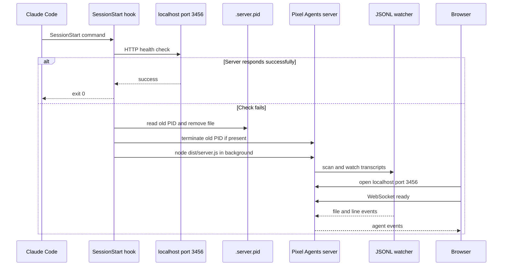

Pixel Agents has no Claude Code API connection. Its integration boundary is the local filesystem: the server reads Claude Code transcript files below the current user's `~/.claude/projects/` directory, converts new JSONL records into agent events, and publishes those events to browser clients over the server's WebSocket. A Claude Code `SessionStart` **command** hook can launch the already-built server on demand; it is optional, not required for transcript discovery.

See [Runtime and protocol](/openwiki/architecture/runtime-and-protocol.md) for the browser protocol, [Development, build, and assets](/openwiki/operations/development-build-and-assets.md) for the build, and [Transcript to agent visualization](/openwiki/workflows/transcript-to-agent-visualization.md) for record-to-activity behavior.

## Contracts and assumptions

### Claude Code filesystem contract

The watcher assumes the current OS account owns a Claude Code directory at `~/.claude/projects/` (`homedir()` plus `.claude/projects`). At startup it enumerates immediate project subdirectories and considers their direct `.jsonl` files active only when their modification time is **less than 10 minutes old**. It then watches the projects tree to depth 3 for newly added `.jsonl` files and polls every tracked file once per second.

Each watched path becomes one agent:

- The session ID is the JSONL filename without `.jsonl`.
- The initial agent identity is keyed by that session ID, so a duplicate `fileAdded` session is ignored by the server.
- The watcher begins at byte offset zero and reads complete newline-terminated records, including existing contents when it first admits a file. A partial final line is buffered until the next read. Invalid JSON records are ignored by the parser rather than terminating the watch.
- A tracked transcript is removed when it disappears or cannot be stat'ed, or when its `mtime` becomes **more than 10 minutes old**. The server removes the corresponding agent and broadcasts `agentClosed`.

The `projectName` shown to users is deliberately a heuristic, not the checked-out repository name. It is the last non-empty `-`-separated segment of the transcript's parent directory name. For example, `-Users-alice-Documents-myproject-657` yields `657`; if the parent name has no usable segment, the first eight characters of the session ID are used. If Claude Code changes its on-disk naming convention, update this derivation or expect misleading labels.

### Transcript and UI boundary

On `fileAdded`, `server/index.ts` creates the in-memory `TrackedAgent`, records the transcript path and project label, and emits `agentCreated`. Subsequent complete lines are handed to `processTranscriptLine`, which recognizes `assistant`, `user`, `system`, and `progress` records. It turns tool starts/results, task-subagent progress, waiting, and permission timing into server messages that are broadcast only to open WebSockets.

When a browser connects, it must send `ready` or `webviewReady` before receiving initialization. The server sends settings and available assets, then `existingAgents`, then `layoutLoaded`; the ordering of the last two is intentional because the UI buffers agents until layout is available. The HTTP server also serves the compiled UI from `dist/public` when running the production entrypoint.

## Auto-launch from SessionStart

The supplied `scripts/cmux-hook.sh` is a Bash command intended to be invoked by Claude Code at SessionStart. Despite its name and comments, the script does not issue a `cmux` command: its responsibilities are an HTTP health check, PID-file cleanup after a failed check, and background launch of the production Node entrypoint.

```json
{
  "hooks": {
    "SessionStart": [
      {
        "type": "command",
        "command": "/path/to/pixel-agents/scripts/cmux-hook.sh"
      }
    ]
  }
}
```

Put this entry in the user's `~/.claude/settings.json`, merging it with—not replacing—existing JSON settings and existing `SessionStart` hooks. Before enabling it, build the project so that `dist/server.js` and its production assets exist:

```bash
npm install
cd webview-ui && npm install && cd ..
npm run build
```

### Hook sequence



This shows the SessionStart health check and recovery path through stale-PID cleanup, startup, transcript watching, and browser connection.

## Required local edits and deployment checklist

These are user- or machine-specific values; do not copy the placeholders unchanged.

1. In `~/.claude/settings.json`, replace `/path/to/pixel-agents/scripts/cmux-hook.sh` with the absolute path to this checkout's script. The hook command is executed by Claude Code, so it must be readable and executable in that environment.
2. In `scripts/cmux-hook.sh`, change `PIXEL_AGENTS_DIR="$HOME/pixel-agents"` to the directory where this user cloned Pixel Agents. `$HOME` is evaluated for the account running the hook. The script constructs both `$PIXEL_AGENTS_DIR/.server.pid` and the `cd` target from this setting.
3. If port `3456` is unsuitable, change `PORT=3456` in the script **and** launch the server with the matching environment variable, for example `PORT=4567 node dist/server.js`. The script's current launch line does not export its shell `PORT` variable to Node; changing only that assignment makes the health check probe a different port while the server still defaults to `3456`. Open the matching `http://localhost:<port>` URL in the browser.
4. Confirm the Claude Code account's `~/.claude/projects/` is the intended transcript location. The server has no setting to watch another root; changing that integration requires changing `CLAUDE_PROJECTS_DIR` in `server/watcher.ts`.
5. Keep the expected compiled entrypoint at `$PIXEL_AGENTS_DIR/dist/server.js`. The hook runs `node dist/server.js`, redirects both streams to `/tmp/pixel-agents.log`, and returns without waiting for the server to bind.

The server additionally persists UI layout and agent-seat metadata under the running user's `~/.pixel-agents/layout.json` and `~/.pixel-agents/agent-seats.json`. These files do not configure Claude discovery or hook launch, but changing the OS account changes both this UI state and the `~/.claude` directory observed by the process.

## Lifecycle, timing, and failure semantics

There are two separate ten-minute rules:

- **Transcript staleness:** a transcript modified within the last 10 minutes is eligible during startup scanning; a tracked transcript older than 10 minutes is removed on a poll. This uses file modification time, not a Claude session lifecycle signal, so a long quiet session can vanish from the office until it writes again. The threshold intentionally allows Claude to think for more than five minutes without writing.
- **Server idle shutdown:** every 30 seconds the server exits only if it has zero tracked agents, zero live WebSocket clients, and no transcript addition or line event for more than 10 minutes. A connected browser prevents this shutdown; browser connection/disconnection itself does not reset the activity clock. `SIGINT` uses the same watcher-stop and HTTP-server-close sequence before exit.

The hook's health check is deliberately quick: `curl -sf --connect-timeout 2 "http://localhost:$PORT/"` treats any successful HTTP response on that localhost port as healthy. It does not verify that the responder is Pixel Agents. If the check fails and `.server.pid` exists, the script attempts `kill` on the file's contents and removes the file before starting Node. Thus a stale or reused PID can target an unrelated process, and two check-failing hook invocations can race to kill/start processes. Use a dedicated checkout and PID file, do not share `3456` with another local service, and inspect `/tmp/pixel-agents.log` after a failed launch. For stronger multi-user or production use, replace this convenience script with a supervisor that validates process identity, serializes startup, owns the port, and manages logs.

If the transcript root is missing or unreadable, the initial scan quietly skips it; the server can still bind and serve the UI but shows no discovered agents. Likewise, unreadable or deleted individual files produce removal rather than a process crash. There is no retry/backoff or error surface for hook startup: if Node exits immediately, the next SessionStart performs the failed health check and attempts a new launch.

## Safe changes and focused validation

Keep the integration seams distinct when modifying behavior:

- Change `JsonlWatcher` only when the external filesystem layout, active-file policy, or tailing behavior changes. Preserve offset-zero catch-up and incomplete-line buffering unless the parser contract also changes.
- Change `processTranscriptLine` when adapting Claude JSONL record shapes or activity semantics; its per-agent timer maps encode waiting, permission, and two-minute long-tool fallback behavior.
- Change `server/index.ts` when changing agent ownership, WebSocket message ordering, lifecycle, or idle shutdown. In particular, preserve `existingAgents` before `layoutLoaded`.
- Change the shell script only with a full build and a real SessionStart exercise. Its production launch depends on the build output rather than `tsx` development mode.

There are no repository-owned test scripts in `package.json`. Validate this integration manually after a production build: start `node dist/server.js`, create or resume a Claude Code session, confirm a recently modified JSONL under `~/.claude/projects/` appears, inspect that the browser receives an agent, and verify disappearance after making the transcript stale or removing it. Then stop the server, invoke the configured hook, check `http://localhost:3456`, `.server.pid`, and `/tmp/pixel-agents.log`. Test an occupied-port scenario separately rather than allowing the hook to kill a process whose PID file it does not own.
