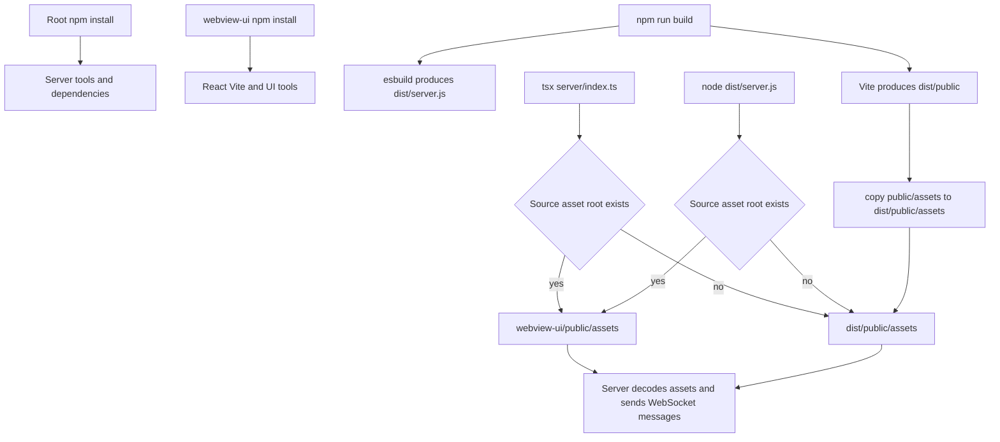

Pixel Agents is a Node/Express server plus a separately installed React/Vite application. The server watches Claude Code sessions and owns disk persistence; the UI connects to it over WebSocket. This page covers the operational boundary between those processes, the production artifact, and the asset and state files that can make a correct code change appear not to work.

For the session watcher and auto-launch hook, see [Claude Code sessions and autolaunch](../integrations/claude-code-sessions-and-autolaunch.md). For the message protocol and its startup ordering, see [Runtime and protocol](../architecture/runtime-and-protocol.md).

## Install and run

There are **two npm projects** and therefore two dependency installations. Install from the repository root, then install the UI dependencies inside `webview-ui/`:

```bash
npm install
cd webview-ui && npm install && cd ..
```

The root package supplies the server runtime/build tools (`tsx`, `esbuild`, `concurrently`) and server dependencies. `webview-ui/package.json` separately supplies React, Vite, TypeScript, and lint tooling. Do not assume the root `node_modules` substitutes for `webview-ui/node_modules`; each project has its own lockfile and package boundary.

### Development

```bash
npm run dev
```

This concurrently runs:

```bash
npm run dev:server
npm run dev:ui
```

`dev:server` is `tsx watch server/index.ts`: it restarts the backend on server-source changes and listens on `PORT` or the default `3456`. `dev:ui` changes into `webview-ui/` and starts Vite. In a Vite development build the browser WebSocket client explicitly connects to `ws://localhost:3456`; Vite is serving the UI while the Express process supplies state and WebSocket messages. Thus, when developing remotely or with a non-default backend port, the hard-coded development WebSocket URL—not merely the Vite URL—must be reachable.

Useful narrower commands are:

```bash
npm run dev:server
npm run dev:ui
cd webview-ui && npm run lint
```

## Build and distribution

Build both halves from the repository root:

```bash
npm run build
npm start
```

`npm run build` executes the server build before the UI build. The first command bundles `server/index.ts` as ESM into `dist/server.js` with esbuild; `chokidar`, `ws`, `express`, and `pngjs` remain external runtime dependencies. The second command runs the UI TypeScript build and Vite, emits the web application into `dist/public`, and then copies `webview-ui/public/assets` into `dist/public/assets`. `npm start` is exactly `node dist/server.js`.

Vite is configured with `base: './'`, so generated client asset URLs are relative, and its configured output directory is `../dist/public` (relative to `webview-ui`). At runtime the bundled server exposes that directory with `express.static(join(__dirname, "public"))`; visiting `http://localhost:3456` therefore serves the built UI and the production client opens a WebSocket to the page host.

> **Operational invariant:** deploy `dist/server.js` together with its sibling `dist/public/` directory. Running or copying only `server.js` loses the UI and production asset root. Since the server bundle externalizes several packages, retain/install its production dependencies as well.

### Build and runtime selection flow



This flow shows the two installations/build outputs and how the server chooses the directory it decodes at startup.

## Asset contract

### Root selection and loading

Asset selection is filesystem-based, not an environment flag. At startup the server first tests `../webview-ui/public/assets` relative to its own module directory. If that directory exists, it uses it; otherwise it uses `./public/assets`. Under `tsx`, `__dirname` is `server/`, so the first path is the source asset directory. Under the esbuild output, `__dirname` is `dist/`, so the fallback is `dist/public/assets`.

The server reads PNGs and JSON at startup, converts pixels to arrays of `#RRGGBB` strings (transparent pixels become empty strings), then sends loaded data only after a client reports `webviewReady` or `ready`. Changing a source asset while the server is already running does not reload it: restart the server. For a packaged run, rebuild after changing public assets so the copy step refreshes `dist/public/assets`.

| Asset under the selected root | Loader expectation | Runtime result if unavailable or invalid |
| --- | --- | --- |
| `characters/char_0.png` through `characters/char_5.png` | All six are expected. Each is sliced into 16×32 frames: seven frames for each of down, up, and right directions. | The character-load message is omitted. The UI falls back to its hard-coded, palette-swapped character templates. |
| `walls.png` | Sliced into 16 16×32 pieces, indexed by cardinal-neighbor bitmask. | The wall-load message is omitted; rendering falls back to a solid wall color. |
| `floors.png` | Optional. If present, its first seven 16×16 patterns are sent. | The UI uses a solid gray 16×16 floor tile and still reports floor sprites as available. |
| `furniture/furniture-catalog.json` and referenced furniture PNGs | Optional catalog. Each catalog `file` is resolved from the parent of the selected asset root, with an `assets/` prefix added when absent. | No furniture-assets message if the catalog cannot load. Individual unreadable/missing sprite files are skipped while the catalog is still sent. |
| `default-layout.json` | Optional source fallback for layout when no persisted layout is readable. | The server sends a null layout; the UI constructs its default office state. |

The current repository includes the six character PNGs and `walls.png` in `webview-ui/public/assets`. It does not require optional floor, furniture, or default-layout assets to start. Nevertheless, PNG sheet dimensions are a practical contract: the loaders index their fixed grids and do not validate dimensions before indexing, so provide sheets large enough for the stated frames/pieces.

### Optional tileset workflows

The repo does not bundle the commercial Office Interior Tileset. The scripts assume locally supplied files and do not download or license them:

```bash
npm run import-tileset
npm run extract-furniture
```

`npm run import-tileset` copies `assets/tileset/Office Tileset/Office Tileset All 16x16.png` to `assets/office_tileset_16x16.png`. This is a standalone copy operation; neither the server asset loader nor the furniture extractor consumes that destination.

`npm run extract-furniture` instead reads `assets/tileset/Office Tileset/Office Tileset All 32x32.png`, scans its 16×32 grid, skips transparent regions and continuation cells of annotated multi-tile items, and writes per-item PNGs plus `furniture-catalog.json` to `webview-ui/public/assets/furniture/`. The generated catalog records pixel dimensions, grid footprint, category, placement flags, and any annotated rotation metadata. Run the production build afterwards to copy those generated files into `dist/public/assets/furniture/`.

If extraction fails with a missing-file error, acquire/place the **32×32** source at the extractor's exact path; copying only the 16×16 source with `import-tileset` does not satisfy it. Review or extend the annotation table in `scripts/extract-furniture.ts` when the source sheet changes, particularly for multi-cell items and rotation groups.

## Persistent user state

The server persists only user-controlled office state under the current OS home directory:

```text
~/.pixel-agents/
├── layout.json
└── agent-seats.json
```

`layout.json` is the complete layout last sent in a `saveLayout` WebSocket message. On startup the server reads it first. If it is absent, unreadable, or invalid JSON, it logs a warning and falls back to `default-layout.json` (or ultimately a null layout). Saving creates `~/.pixel-agents` recursively, updates the in-memory layout, and broadcasts `layoutLoaded` to every *other* connected client for multi-tab synchronization.

`agent-seats.json` is an object keyed by numeric, server-assigned agent IDs. Each value has this shape:

```json
{
  "1": {
    "palette": 0,
    "hueShift": 0,
    "seatId": "desk-1"
  }
}
```

The UI saves only non-subagent characters and records `{ palette, hueShift, seatId }`; `seatId` may be `null`. The server reads this file once at startup and uses its metadata when sending existing agents. The UI buffers those agents until after `layoutLoaded`, ensuring seat IDs are interpreted after seats have been built. A malformed seats file is silently treated as absent. Importantly, these keys are ephemeral sequential IDs, not Claude session IDs: seat/palette continuity is only meaningful while the server assigns the same IDs, and stale entries may be retained in the JSON.

### Reset and stale-state recovery

1. Stop the server (or allow its restart cycle to finish).
2. Back up, edit, or remove `~/.pixel-agents/layout.json` to discard a stale custom layout. The next start uses the bundled default when available, otherwise the UI default.
3. Remove `~/.pixel-agents/agent-seats.json` to reset palette, hue, and seating metadata.
4. Restart the server and refresh/reconnect the browser.

Do not delete `~/.claude/projects/` as a layout reset; that is the independent transcript source watched for sessions.

## Lifecycle and shutdown

The server starts the JSONL watcher before listening, serves static production files, and maintains WebSocket clients with a 30-second ping/pong heartbeat. It exits after ten minutes only when there are no tracked agents, no live WebSocket clients, and no newer watcher activity; the guard runs every 30 seconds. On this idle shutdown and on `SIGINT`, it stops the watcher, closes the HTTP server, and calls `process.exit(0)`.

This means leaving a browser tab connected prevents idle shutdown even if no Claude session is active. Conversely, the automatic shutdown does not delete `~/.pixel-agents` state. For hook-based operation, the launcher health-checks `http://localhost:3456/`, kills a PID found in `.server.pid` if the server is unhealthy, then backgrounds `node dist/server.js` and logs to `/tmp/pixel-agents.log`.

## Troubleshooting checklist

| Symptom | Checks and recovery |
| --- | --- |
| Blank page or old UI after `npm start` | Run `npm run build`; verify both `dist/server.js` and `dist/public/index.html` exist. Deploy the whole `dist/public` tree, not just the server bundle. |
| UI opens in development but no live data | Start both commands via `npm run dev`; check the backend at port `3456`. The development client targets `ws://localhost:3456`, independent of the Vite port. |
| Characters or walls look generic | Inspect the startup asset-root log, then verify `characters/char_0.png`–`char_5.png` and `walls.png` beneath that root. Restart after changes. Generic hard-coded characters and flat walls are expected fallbacks, not necessarily a protocol failure. |
| Floor is plain gray | This is the designed fallback when `floors.png` is absent or fails to parse. Add a suitable sheet under the selected root and restart. |
| Furniture catalog is absent or incomplete | Verify `furniture/furniture-catalog.json`, its `file` values, and all PNGs. Run `npm run extract-furniture` only after providing the exact 32×32 source sheet, then rebuild for distribution. Loader logs include the loaded/declared sprite count. |
| Layout changes seem ignored or persist unexpectedly | Inspect or back up `~/.pixel-agents/layout.json`. Persisted layout has priority over `default-layout.json`; remove it for a clean fallback. Ensure the UI was able to send its debounced save, or use its explicit save action before stopping the server. |
| Agents receive unexpected seats/colors | Inspect or remove `~/.pixel-agents/agent-seats.json`. Treat agent-ID keyed entries as disposable because IDs restart from one with each server process. |
| Server will not exit | Close browser tabs and wait more than ten minutes without active Claude sessions, or interrupt with `SIGINT`. Check stale hook processes/PID state if the launcher starts duplicates. |

## Change validation

For a normal change, validate the boundary you touched rather than relying on a single UI refresh:

```bash
npm run build
cd webview-ui && npm run lint
```

Then start the appropriate mode and inspect the server startup log for the chosen asset root and loader counts. For asset changes, exercise a fresh connection because initial asset/layout messages are emitted in response to readiness. For persistence changes, test both a clean home-state directory and malformed `layout.json`/`agent-seats.json`, then verify that layout is sent after existing-agent metadata. The root package defines no `test` script, so build/lint plus these targeted runtime checks are the repository-provided validation path.
