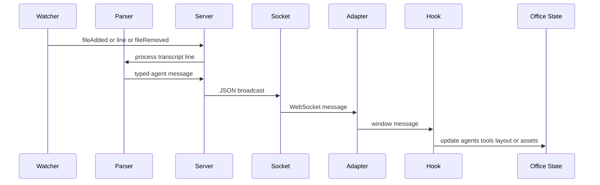

This repository has **no discovered first-party test suite or `test` script**. The root scripts cover development, builds, asset import/extraction, and start; the UI scripts cover build and lint. Test files and `test` scripts found under `node_modules` belong to dependencies, not to this project, and must not be represented as project coverage. Consequently, a successful build or lint run is a necessary gate, not behavioral coverage: changes to transcript interpretation, timers, WebSocket messages, assets, and canvas/editor behavior require targeted manual validation.

## Baseline gate

Run the narrowest relevant commands during development, then run the packaging gate before delivery:

```bash
npx tsc --noEmit
cd webview-ui && npm run lint && npm run build
cd .. && npm run build
```

The root TypeScript configuration is strict and covers `server/**/*.ts` and `scripts/**/*.ts`, but excludes `webview-ui`; the UI build runs `tsc -b` before Vite. The root `build` bundles `server/index.ts` with esbuild to `dist/server.js`, builds the UI into `dist/public`, and copies `public/assets` into that deployable UI directory. `npm run start` then runs `node dist/server.js`.

Use `npm run dev` when a live scenario is needed: it concurrently starts `tsx watch server/index.ts` and Vite. For a production-like check, use the build/start sequence and open `http://localhost:3456`. The server reads `PORT` with a default of `3456`; the development UI WebSocket is hard-coded to `ws://localhost:3456`, so use the matching port unless both sides are intentionally changed.

> **Scope of the gate.** `npx tsc --noEmit` is a server/scripts type check, `npm run lint` is a UI static-analysis check, and `npm run build` verifies compilation/bundling. None executes application-owned parser, watcher, protocol, editor, rendering, or persistence tests.

## What must remain compatible

The live path is a protocol and ordering contract rather than an HTTP API test surface. A watcher discovers and tails Claude JSONL session files, the parser mutates a per-session `TrackedAgent` and emits typed server messages, the server broadcasts those messages, and the UI WebSocket adapter turns them into `window` messages consumed by `useExtensionMessages`.



This shows the production event route that manual transcript and WebSocket checks must exercise.

### Ordering and lifecycle invariants

- A newly connected client sends `webviewReady` (or `ready`) and receives initial settings/assets, `existingAgents`, then `layoutLoaded`. The UI deliberately buffers existing agents until layout loading so seats have been constructed before agents are added. Preserve this ordering when extending initial sync.
- The parser owns timer-driven status semantics. Tool use clears a pending waiting timer, marks the agent active, tracks tool IDs, and starts a 120-second inactivity fallback; text-only assistant output waits five seconds before emitting `waiting`. Non-exempt tools can trigger a permission indication after seven seconds, while `bash_progress` and `mcp_progress` restart that permission timer. A `turn_duration` system record cancels timers, clears active and subagent tools, and sends `waiting`.
- Watcher offsets and `lineBuffer` make JSONL tailing incremental: it reads only bytes beyond its offset and retains the final incomplete newline-delimited record for the next poll. It initially includes only files modified within ten minutes, polls tracked files every second, and removes files when stale, missing, or unreadable. Changes must retain correct behavior for partial writes, catch-up reads, session removal, and an absent `~/.claude/projects` directory.
- Layout messages are stateful. The server persists a saved layout at `~/.pixel-agents/layout.json`, sends it to new clients, and relays a save to other connected clients. The UI ignores a later external `layoutLoaded` while its editor has unsaved changes. Layout changes therefore need both single-client persistence and multi-tab/dirty-editor checks.

## Focused validation matrix

Choose every row affected by a change; do not substitute unrelated build success for the scenario described.

| Change area | Static/build gate | Focused manual check | Safety properties to verify |
| --- | --- | --- | --- |
| Parser, activity state, or timers | `npx tsc --noEmit`; root build | Feed a controlled JSONL session, or append complete JSONL lines to an active session. Exercise assistant text-only output, a reading tool, a non-exempt tool, its result, a new user prompt, `turn_duration`, and malformed JSON. For `Task`, also exercise subagent start/result/clear. | Invalid JSON is ignored; tool IDs do not duplicate; tool completion is delayed but observed; timers are cancelled/restarted on the right transitions; active tools and permission bubbles clear at turn boundaries; waiting behavior matches the five-second, seven-second, and 120-second paths. |
| Watcher changes | `npx tsc --noEmit`; root build | Start the server with a recent JSONL file under `~/.claude/projects`, then append a record in two writes with the newline arriving last. Add a new `.jsonl`, remove it or make it stale, and repeat with no projects directory. | Existing content is caught up once; partial records are not parsed early or lost; new files add one agent; stale/missing files remove it; unreadable/missing directories do not crash the server. |
| WebSocket protocol or initial sync | Server/UI type and build gates; UI lint | Connect a browser, inspect WebSocket frames, then reconnect. Confirm assets, agents, and layout arrive and render. Test live tool/status updates and a layout save from a second tab. | JSON message discriminants and fields agree across `ServerMessage`, server emission, WebSocket adapter, and hook; `existingAgents` precedes `layoutLoaded`; duplicate/reconnect delivery does not create duplicate tools or agents; only peers receive a layout echo. |
| Layout, editor, furniture, or simulation | UI lint and UI build | Enter edit mode; paint floor/wall/VOID, place, move, rotate, toggle, and delete furniture; undo/redo; expand in all directions; save and reload. Keep one tab dirty while another saves. Add enough agents to test seat assignment and test a layout with few/no walkable tiles. | Edits that are invalid return the unchanged layout; normal furniture does not occupy walls/VOID or overlap; wall and surface rules still work; left/up expansion shifts tiles, furniture, and characters coherently; rebuilding preserves valid seats or reassigns safely; dirty work is not overwritten by external sync. |
| Assets and catalogs | UI build; root packaging build | Verify baseline character/wall rendering, optional floor fallback, and furniture catalog rendering in dev and packaged startup. If changing extraction/catalog assets, run the relevant `npm run import-tileset` or `npm run extract-furniture` workflow before rebuilding. | Missing character/wall/catalog resources degrade to absent optional payloads rather than a server crash; missing `floors.png` retains UI fallback; each catalog entry’s dimensions, footprint, and sprite file agree enough for placement and render depth. |
| Build, static serving, or packaging | Full baseline gate | Delete or clean `dist`, run `npm run build`, then `npm start`; load the app and establish a WebSocket session. | `dist/server.js` can find `dist/public/assets`; Express serves the production UI; the server selects source assets in development and packaged assets in production; no required asset is omitted by the copy step. |

## Protocol-change review

Treat `server/types.ts` and `useExtensionMessages.ts` as the two ends of an explicit wire contract. Before changing a message, enumerate its producer, the `ServerMessage` or `ClientMessage` union member, every server receiver/emitter, the UI handler branch, and the state it mutates. The UI adapter intentionally dispatches parsed WebSocket messages as browser `message` events to reuse the hook; adding a server message without a hook branch can silently produce no visual behavior.

Review both directions:

- **Server to client:** agent creation/closure, tool start/done/clear, status and permission notifications, subagent events, assets, layout, and settings. Check that a new field is optional or supplied by every producer, and that replay on reconnect is coherent.
- **Client to server:** `ready`/`webviewReady`, `saveLayout`, and `saveAgentSeats`. A save currently writes JSON without schema validation; do not assume malformed but parseable layout data will be rejected. Validate changed payload shape manually before relying on it for persistence.

A protocol patch should include a compatibility note in its review: whether an older UI can ignore the message, whether an older server can tolerate the client request, and whether delivery order or reconnect replay changes. The standalone fork preserves an upstream-style message interface in the hook, so changing discriminants or semantics deserves particular scrutiny.

## Layout and editor regression focus

The editor action functions are immutable and often signal invalid input by returning the original layout. `canPlaceFurniture` is the placement authority: it enforces map bounds, wall versus non-wall tile rules, occupied footprint conflicts, background rows, and the exception for surface-placeable items on desk tiles. Do not validate editor work only by checking that TypeScript compiles; test the visual grid, collision behavior, pathing, and saved/reloaded layout together.

`OfficeState.rebuildFromLayout` recomputes tile map, seats, blocked tiles, furniture instances, and walkable tiles. It shifts character coordinates on left/up growth, preserves still-valid seat assignments first, then assigns free seats, and relocates unseated characters only if they fall outside bounds. Regression checks should therefore include a seated agent through layout edits and ensure chairs continue to yield seats with the expected facing direction.

## Failure investigation and change discipline

1. **Classify the boundary first.** A missing agent can be watcher discovery, server session mapping, parser interpretation, WebSocket delivery, or hook/state application; use server logs, WebSocket frames, and the UI debug view to locate the first missing transition.
2. **Use representative transcripts, not only happy paths.** Preserve samples for malformed lines, split writes, tool starts/results, `Task` nested events, progress, user prompts, and final `turn_duration`. These are manual fixtures today, not automated tests.
3. **Check time-dependent behavior explicitly.** Avoid judging a timer change immediately: observe the relevant five-second waiting delay, seven-second permission delay, delayed tool-done event, and—where modified—the 120-second idle fallback.
4. **Test persistence without destroying user data.** Back up or use disposable contents for `~/.pixel-agents/layout.json` and `agent-seats.json`; confirm failed reads fall back to the default layout and failed writes are logged rather than crashing the connection.
5. **Record what was actually run.** In a change description, distinguish successful type/lint/build commands from manual scenarios and their observed results. Do not report dependency test output or a tool’s own internal tests as repository test coverage.

## Suggested future automation seams

The absence of first-party tests makes small, isolated seams valuable. Extract or retain pure tests around `processTranscriptLine` with fake timers and captured emitted messages; incremental watcher reading with temporary files; layout action invariants (unchanged on invalid operation, `tiles.length === cols * rows`, collision rules); and protocol fixtures replayed through the hook. Such tests should be added with an explicit project runner and script. Until then, the matrices above are the repository’s change-safety standard rather than a claim of automated coverage.

## Related documentation

- [Office Layout and Simulation](../concepts/office-layout-and-simulation.md) — layout model, rendering, seating, and simulation context.
- [Development Build and Assets](../operations/development-build-and-assets.md) — development and distribution operations.
- [Quickstart](../quickstart.md) — installation and normal startup path.
- [Transcript to Agent Visualization](../workflows/transcript-to-agent-visualization.md) — end-to-end transcript behavior.
