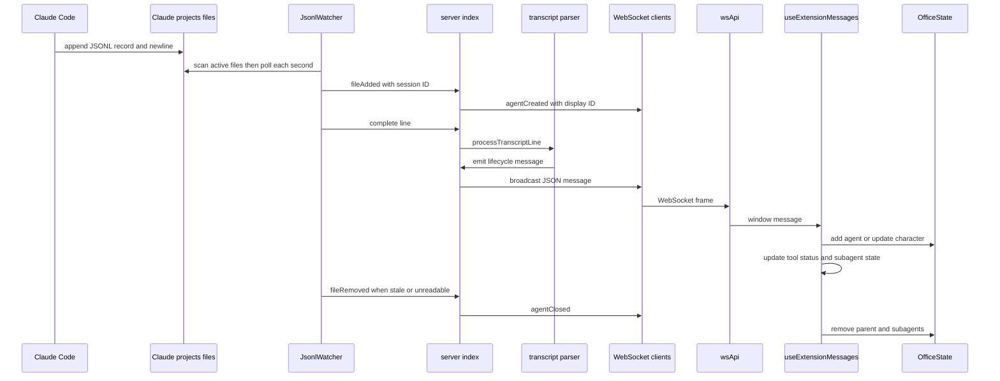
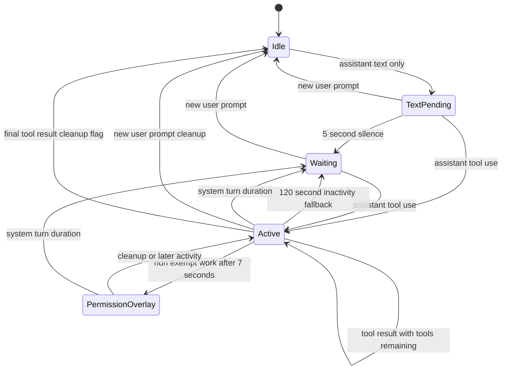

## Scope and ownership

This workflow is a local, append-only transcript visualization pipeline, not a Claude control channel. `JsonlWatcher` discovers and tails Claude Code JSONL files; `server/index.ts` owns the live session-to-agent registry and broadcasts parser output; `processTranscriptLine` interprets recognized records and owns time-based activity inference; and `useExtensionMessages` turns WebSocket-delivered messages into React overlay state and mutations on the imperative `OfficeState`.

The pipeline deliberately has two identities:

- **Session ID** is the JSONL filename without `.jsonl`. It is the stable key used by the watcher and the server's `agents` map, and prevents a duplicate `fileAdded` event from creating another tracked agent.
- **Display ID** is a process-local, monotonically allocated number (`nextAgentId`) sent to the browser. It indexes characters, tool overlays, statuses, and persisted seat metadata. It restarts after a server restart and must not be treated as a Claude session identifier.

A watched directory name is only a display heuristic: the watcher takes the last non-empty `-`-separated segment of the transcript parent directory, falling back to the first eight session-ID characters. The resulting project name accompanies `agentCreated` as the character folder label.

## Discovery, tailing, and membership lifecycle

The watcher targets `homedir()/.claude/projects`. On start, it scans immediate project directories and admits direct `.jsonl` files modified less than **10 minutes** ago. It also uses `chokidar` to admit subsequently added JSONL files and polls every admitted file every **1 second**. Admission emits `fileAdded` *before* the watcher reads from byte offset zero, so a server started after a session has already written can catch up through existing records.

Tailing is incremental and newline-safe. Each file keeps a byte offset and `lineBuffer`; a poll reads only bytes beyond the offset, prepends the saved fragment, emits nonblank complete newline-delimited lines, and retains the final incomplete fragment for the next poll. Thus a JSON object split across writes is not given to the parser prematurely. A tracked file is removed when it cannot be stat'ed/read or when its modification time becomes older than 10 minutes; this emits `fileRemoved`, which deletes the server agent and broadcasts `agentClosed`. Missing project directories and unreadable subdirectories are silently skipped, while a file-read failure is tolerated until polling determines removal.

On `fileAdded`, the server initializes `TrackedAgent` with an idle activity, empty parent/subagent tool collections, and parser flags, stores it under the session ID, then broadcasts `agentCreated` with the numeric display ID. On each watcher `line`, it looks up the same session-keyed agent and calls `processTranscriptLine`; no agent is created merely by parsing a line.

This sequence shows discovery and one-second tail polling through record interpretation, broadcast, and client-state application.

## Record dispatch and parent-tool interpretation

The parser first `JSON.parse`s each complete line. Malformed JSON is ignored with no event or state transition. For parsed records, only top-level `assistant`, `user`, `system`, and `progress` types are handled; other record types are ignored. Shape checks similarly cause incomplete or unsupported record payloads to be ignored rather than throwing.

### Assistant records: tool starts and text-only completion inference

An `assistant` record must have an array `message.content`. If it contains one or more `tool_use` blocks:

1. A pending text waiting timer is cancelled; the agent becomes non-waiting, records that the turn used tools, and emits `agentStatus: active`.
2. Every valid `tool_use` block is recorded by its Claude `toolId`, given a human-readable status, and emits `agentToolStart`. The active animation category is `reading` for `Read`, `Grep`, `Glob`, `WebFetch`, and `WebSearch`; all other tools use `typing`.
3. A non-exempt tool resets `permissionSent` and starts the permission timer. `Task` and `AskUserQuestion` are exempt, so they alone do not produce the parent permission indicator.
4. A **120-second** inactivity timeout is (re)started. If it expires while the activity is neither idle nor waiting, the parser clears tracked activity and emits `agentStatus: waiting`. This is a fallback for long-running tools rather than evidence of a transcript turn end.

Status text is presentation data, not a raw transcript echo. For example, file tools use basenames, Bash command display is truncated to 30 characters, Task descriptions to 40 characters, and unknown tools become `Using <name>`. The UI derives an animation tool name from the status prefix, so changing status strings requires coordinated changes to `toolUtils.ts`.

An assistant record with text but no tool use starts a **5-second** silence timer only if `hadToolsInTurn` is false. On expiry it clears the flag, marks the agent waiting, and emits `agentStatus: waiting`. Text that follows tools in the same turn does not take this route.

### User records: results versus a new prompt

For array content containing `tool_result` blocks, each referenced parent tool is removed from the active maps and an `agentToolDone` event is emitted after **300 ms**. The delay is intentional. When the final active parent tool is removed, `hadToolsInTurn` is reset, but this path does not itself emit waiting.

A user record that is not a tool-result payload—either non-result array content or a nonblank string—is treated as a new user prompt. It cancels the waiting and idle timers, clears parent/subagent tool state and a previously sent permission indication, and resets the turn flag. `clearAgentActivity` emits `agentToolsClear` only when tracked parent tools existed, and emits `agentToolPermissionClear` only when a permission message had been sent; consumers must therefore not assume every new prompt produces both messages.

A `system` record with subtype `turn_duration` is the definitive parser-side turn cleanup. It cancels all three timer classes, clears any parent and nested tool maps with `agentToolsClear`, resets permission and turn flags, sets activity to waiting, and emits `agentStatus: waiting` whether or not tools were present.

## Waiting and permission timing

Permission is an overlay on outstanding work, not a separate parser activity state. After **7 seconds**, the permission timer scans both active parent tool names and nested Task tool names. If any is non-exempt and a permission event has not already been sent for that timer cycle, it emits `agentToolPermission` and marks `permissionSent`. The UI marks every unfinished parent tool with `permissionWait` and displays a permission bubble on the parent character.

`bash_progress` and `mcp_progress` records only restart this 7-second permission timer when their `parentToolUseID` names an active parent tool. They do not report completion or alter tool display. A new tool start, user-prompt cleanup, or `turn_duration` cancels/replaces relevant timers. There is a declared `subagentToolPermission` protocol variant and UI handler, but this parser emits the parent `agentToolPermission` event even when the qualifying work is a nested tool; it does not emit `subagentToolPermission`.

This state diagram models parser lifecycle inference; the permission overlay is visual state on top of active work, while `turn_duration` is the authoritative waiting transition.

## Task subagent correlation

A parent `Task` is first handled as an ordinary `agentToolStart`, but its formatted status begins `Subtask:`. The hook recognizes that prefix, allocates a visual subagent through `OfficeState.addSubagent(parentAgentId, parentToolId)`, and stores a label. `OfficeState` keys this relationship as `parentAgentId:parentToolId`, uses a negative generated character ID for the subordinate, inherits the parent palette/hue, and prefers the closest free seat to its parent.

Nested activity is sourced from `progress` records, not an independent watched session. The parser requires `parentToolUseID` to identify an active parent whose name is `Task`, then reads the nested `data.message.message.content` envelope:

- Nested assistant `tool_use` blocks are tracked under the parent Task ID and produce `subagentToolStart` with both the parent Task ID and inner tool ID. The hook deduplicates by inner tool ID, updates the subagent tool list, and marks the matching negative-ID character active with the derived tool name.
- Nested user `tool_result` blocks remove their inner IDs/names and emit `subagentToolDone` after 300 ms.
- Completion of the parent Task result removes its nested maps and emits `subagentClear` before the parent's delayed `agentToolDone`. The hook removes the subordinate tool group and calls `removeSubagent` for exactly that parent/tool key.

Global cleanup (`agentToolsClear`) and agent closure remove all subagents of the parent. This parent-tool correlation is essential: do not correlate nested events solely by inner tool ID, which is scoped beneath a Task.

## UI application and visual consequences

`wsApi.ts` parses a server WebSocket frame and redispatches it as a browser `message`; `useExtensionMessages` consumes that compatibility event. For membership, `agentCreated` appends/selects the display ID, creates an `OfficeState` character, and saves seat metadata; `agentClosed` removes React records, all owned subagents, and the parent character. Agent creation is idempotent in `OfficeState`, and tool-start reducers deduplicate tool IDs, helping tolerate repeat delivery.

For tools, start appends `{ toolId, status, done: false }`, sets the current tool and active flag, and clears a parent permission bubble. Done changes only that tool's `done` flag, so it remains available to the UI until a later clear. `agentToolsClear` deletes parent and nested tool overlays, removes all visual subagents, clears current tool and permission bubble. `agentStatus: active` clears a stored status and marks the character active; `waiting` records the status, marks it inactive, shows a waiting bubble, and plays the completion sound.

`OfficeState` uses active state to drive more than the sprite: an inactive transition clears movement and uses a sentinel to avoid an immediate seat-rest cycle, while active seated characters can switch nearby electronics to their render-only on variant. Waiting bubbles start at two seconds and can be click-dismissed with a 0.3-second fast fade; permission bubbles persist until cleared or dismissed. The office simulation owns visual behavior, whereas transcript semantics remain in the server parser.

## Initial sync and operational checks

Live events are broadcast only to currently connected clients. A newly connected client sends `webviewReady` or `ready` and receives an initial snapshot containing existing display IDs but no replay of transient tool/status overlays. The server deliberately sends `existingAgents` before `layoutLoaded`; the hook buffers those agents until it rebuilds seats from the layout, then adds them with any persisted palette, hue, and seat metadata. Preserve this ordering when changing initial synchronization.

For a safe change, validate the entire wire contract: `ServerMessage` union, parser emission, WebSocket broadcast, and hook branch must agree on discriminant and fields. Exercise a recent pre-existing transcript, a partial final JSONL line, malformed JSON, a reading and a non-exempt tool, a delayed tool result, text-only waiting, new-prompt cleanup, `turn_duration`, and a Task with nested start/result/parent completion. The repository has no first-party parser or watcher tests; use the build/lint gates and manual matrix in [Validation and Change Safety](/openwiki/testing/validation-and-change-safety.md), alongside [Runtime and Protocol](/openwiki/architecture/runtime-and-protocol.md) and [Claude Code Session Integration](/openwiki/integrations/claude-code-sessions-and-autolaunch.md).
